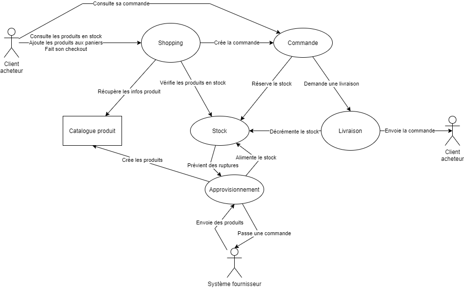

# Documentation fonctionnelle

Le système logistique est constitué des briques suivantes :
* Le `catalogue produit` contient la base des produits connus et leur prix associé. Il référence l'ensemble des produits qui peuvent être achetés sur la plateforme
* Le système d'`approvisionnement` reçoit les produits physiques et s'assure de leur intégration dans le `catalogue produit` et dans le `stock`
* Le système de `gestion des stocks` est la plaque tournante. Il permet de lister les références en stock, ainsi que leurs quantités disponibles et réservées.
* Le système de `shopping` permet au client de récupérer la liste des produits en stock, de les ajouter au panier et de passer une commande.
* Le système de `commande` permet de réserver les produits en stock, demander une livraison et stocke l'historique des commandes avec le prix payé
* Le système de `livraison` achemine les colis au client, et gère les retours

